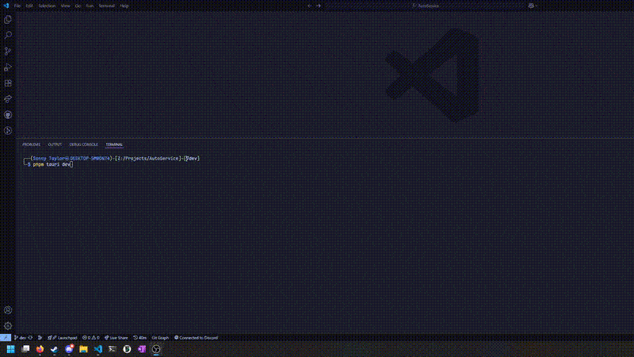

<div align="center">
  
  <h1>AutoService</h1>
  <p><strong>A Windows 10/11 Swiss-Army knife desktop toolkit for computer repair technicians and power users.</strong><br/>
  Automate cleanup, diagnostics, testing, scripted workflows, and reporting – from a single portable executable.</p>
  <p>
    <a href="https://sonnytaylor.github.io/AutoService/">📚 Documentation</a> ·
    <a href="#features">Features</a> ·
    <a href="https://github.com/SonnyTaylor/AutoService/releases">Releases</a> ·
    <a href="https://github.com/SonnyTaylor/AutoService/issues">Issues</a>
  </p>
  
</div>

<p align="center">
  <a href="https://github.com/SonnyTaylor/AutoService/stargazers"></a>
  <a href="https://github.com/SonnyTaylor/AutoService/issues"></a>
  <a href="https://github.com/SonnyTaylor/AutoService/blob/main/LICENSE"></a>
  <a href="https://github.com/SonnyTaylor/AutoService/commits/dev"></a>
  <a href="https://github.com/SonnyTaylor/AutoService/releases"></a>
  <a href="https://github.com/SonnyTaylor/AutoService/graphs/contributors"></a>
  
  
  
</p>

## Overview

AutoService is a Rust + Tauri desktop application (HTML/CSS/vanilla JS frontend) for Windows focused on accelerating common service bench tasks:

- Run multiple cleanup, security, and maintenance tools with minimal clicks
- Collect system information and component test results in one place
- Provide a consistent portable toolkit you can drop onto any Windows machine from a USB drive

The project is under active development; flows are maturing quickly. Feedback & contributions welcome.

## 📚 Documentation

**Complete documentation is available at [sonnytaylor.github.io/AutoService](https://sonnytaylor.github.io/AutoService/)**

- **[User Guide](https://sonnytaylor.github.io/AutoService/user-guide/overview/)** - Learn how to use AutoService
- **[Developer Guide](https://sonnytaylor.github.io/AutoService/developer-guide/overview/)** - Contribute to the project
- **[Architecture](https://sonnytaylor.github.io/AutoService/developer-guide/architecture/)** - Understand the system design

## ✨ Features

- **Service Automation** - Queue and run maintenance tasks (BleachBit, SFC, DISM, AdwCleaner, smartctl, etc.)
- **Stress Testing** - GPU/CPU/RAM stress testing with FurMark and HeavyLoad
- **System Diagnostics** - Comprehensive hardware/OS information collection
- **Component Testing** - Camera, microphone, speakers, mouse, display, and network tests
- **Program Launcher** - Manage and launch portable tools from a unified interface
- **Script Catalog** - Store and execute frequently used PowerShell/CMD scripts
- **Report Generation** - Generate technical and customer-facing reports
- **Portable Design** - Run from USB drives with all tools and settings in a portable `data/` folder

## 🚀 Quick Start

### Option 1: Use Precompiled Executable

Download the latest precompiled `.exe` from the [Releases page](https://github.com/SonnyTaylor/AutoService/releases). Simply run the executable—no installation required. It's fully portable and can be used from a USB drive.

### Option 2: Build from Source

#### Prerequisites

- Windows 10/11
- Node.js + pnpm
- Rust toolchain (install via <https://rustup.rs/>)

#### Development Setup

```powershell
git clone https://github.com/SonnyTaylor/AutoService.git
cd AutoService
pnpm install

# Run in development mode (requires admin terminal)
pnpm tauri dev

# Build portable executable
pnpm tauri build
```

For detailed setup instructions, see the [Developer Guide](https://sonnytaylor.github.io/AutoService/developer-guide/dev-setup/).

## 🏗️ Architecture

AutoService uses a three-layer architecture:

- **Frontend**: Vanilla JavaScript + Vite (hash-based SPA router)
- **Backend**: Rust + Tauri (IPC commands for system operations)
- **Service Runner**: Python (PyInstaller-packaged, executes automation tasks)

All external tools live in a portable `data/` folder that travels with the executable, making it perfect for USB deployment.

Learn more in the [Architecture Guide](https://sonnytaylor.github.io/AutoService/developer-guide/architecture/).

## 🤝 Contributing

Contributions are welcome! Please see the [Contributing Guide](https://sonnytaylor.github.io/AutoService/developer-guide/contributing/) for details on:

- Adding new services
- Frontend/backend development
- Testing and debugging
- Code style and conventions

## 📝 License

Distributed under the GNU General Public License v3.0. See `LICENSE` for details.
