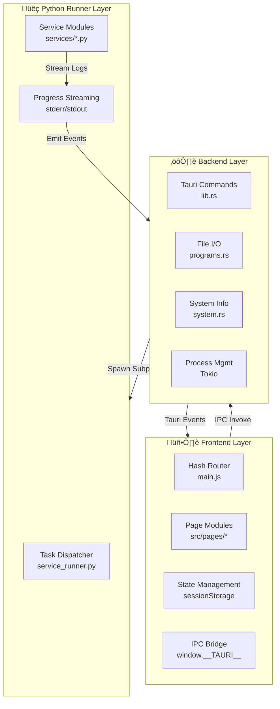

# Architecture

Deep dive into AutoService's three-layer architecture and data flow patterns.

## Three-Layer Architecture

AutoService uses a clean separation of concerns across three layers:

### Layer 1: Frontend (Vanilla JS + Vite)

**Responsibilities:**

- User interface and interactions
- Task queue management (builder)
- Results display and reporting
- Local state management (sessionStorage/localStorage)

**Technologies:**

- HTML, CSS, vanilla JavaScript
- Vite build tool
- lit-html for templating
- No framework dependencies

**Key Files:**

- `src/main.js` - Hash-based router
- `src/pages/*/` - Page modules
- `src/utils/` - Shared utilities

### Layer 2: Backend (Rust + Tauri)

**Responsibilities:**

- File I/O and data persistence
- System information collection
- External process management
- IPC command dispatch

**Technologies:**

- Rust programming language
- Tauri desktop framework
- sysinfo crate for hardware info
- tokio async runtime

**Key Files:**

- `src-tauri/src/lib.rs` - Command registration
- `src-tauri/src/*.rs` - Command implementations
- `src-tauri/tauri.conf.json` - Configuration

### Layer 3: Python Runner (Async Service Executor)

**Responsibilities:**

- Execute maintenance and diagnostic tasks
- Subprocess management
- Real-time progress streaming
- Report generation

**Technologies:**

- Python 3.9+
- PyInstaller packaging
- Subprocess and asyncio

**Key Files:**

- `runner/service_runner.py` - Main orchestrator
- `runner/services/*.py` - Task implementations
- `runner/requirements.txt` - Dependencies

## Data Flow: Running a Service

### Complete Service Execution Flow


### Architecture Layers



## IPC Communication Patterns

### Frontend → Rust (Invoke)

```javascript
// Frontend calls Rust command with data
const result = await window.__TAURI__.core.invoke("command_name", {
  arg1: value1,
  arg2: value2
});
```

### Rust → Frontend (Events)

```rust
// Rust emits event to frontend
app.emit("event_name", payload)?;
```

### Frontend Listens to Events

```javascript
// Frontend listens for events
window.__TAURI__.event.listen("event_name", (event) => {
  console.log(event.payload);
});
```

## Key Design Patterns

### 1. Self-Contained Service Handlers

All logic for a service lives in one place:

```
src/pages/service/handlers/my_service/
├── index.js              # definition, renderTech, extractCustomerMetrics, printCSS
├── README.md
└── fixtures/
    └── test_my_service.json
```

This keeps related code together and makes services easy to add/remove.

### 2. Portable Data Directory

All settings, tools, and reports live in `data/`:

```
AutoService.exe
data/
├── programs/    # External tools
├── settings/    # JSON configs (relative paths)
├── reports/     # Generated reports
└── logs/        # Execution logs
```

**Benefits:**

- USB portability (no absolute paths)
- Offline operation
- User customization without code changes
- Easy data backup

### 3. Real-Time Progress Streaming

Python runner emits markers to stderr:

```python
sys.stderr.write("TASK_START: sfc_scan\n")
sys.stderr.flush()  # Critical!

# ... do work ...

sys.stderr.write("TASK_OK: sfc_scan\n")
sys.stderr.flush()
```

Frontend listens and updates UI in real-time.

### 4. Standard Service Response Schema

All services return consistent structure:

```python
{
    "task_type": "service_id",
    "status": "success" | "error" | "warning",
    "summary": {
        "human_readable": {...},    # User-friendly data
        "results": {...}             # Raw technical data
    },
    "duration_seconds": 123.45
}
```

### 5. Hash-Based Router

Frontend uses hash routing for SPA:

```
#/service           → Service presets
#/service-run       → Service builder
#/service-results   → Results viewer
#/programs          → Program management
#/settings          → Configuration
```

No server required, works from file.

## State Management

### Frontend State

**SessionStorage** (transient, cleared on tab close):

- `service.pendingRun` - Queued tasks
- `service.finalReport` - Completed results
- `tool.statuses.v1` - Cached tool availability

**LocalStorage** (persistent):

- `service.finalReport` - Report fallback
- Business settings
- App configuration

### Backend State

**AppState** (in-memory):

- `data_dir` - Path to data folder
- Connected app handle for event emission

## Async Patterns

### Frontend → Tauri → Python

```javascript
// Frontend (async/await)
const result = await invoke("start_service_run", { plan });

// Rust (tokio async)
#[tauri::command]
async fn start_service_run(plan: RunPlan) -> Result<(), String> {
    // Spawn subprocess
    // Listen to stdout/stderr
}

// Python (runs synchronously)
def main():
    tasks = parse_plan(json_input)
    run_tasks(tasks)
    print_final_report()
```

## Error Handling Strategy

1. **Python errors** → Return error status in response
2. **Rust errors** → Convert to IPC error message
3. **Frontend errors** → Display user-friendly message
4. **User messages** → Via notification system

## Performance Considerations

1. **Lazy loading** - Pages load only when routed
2. **Vite code splitting** - Automatic chunk optimization
3. **No re-renders** - Vanilla JS, no framework overhead
4. **Async subprocess** - Python runner runs in background
5. **Streaming output** - No waiting for full results

## Security Considerations

1. **Admin privileges** - UAC prompt ensures user consent
2. **Sandboxed scripts** - Python runner subprocess isolation
3. **No network by default** - Only for explicit tests
4. **Data folder controls** - User owns all tool/setting files

---

Next: [Adding a Service](adding-service.md)
