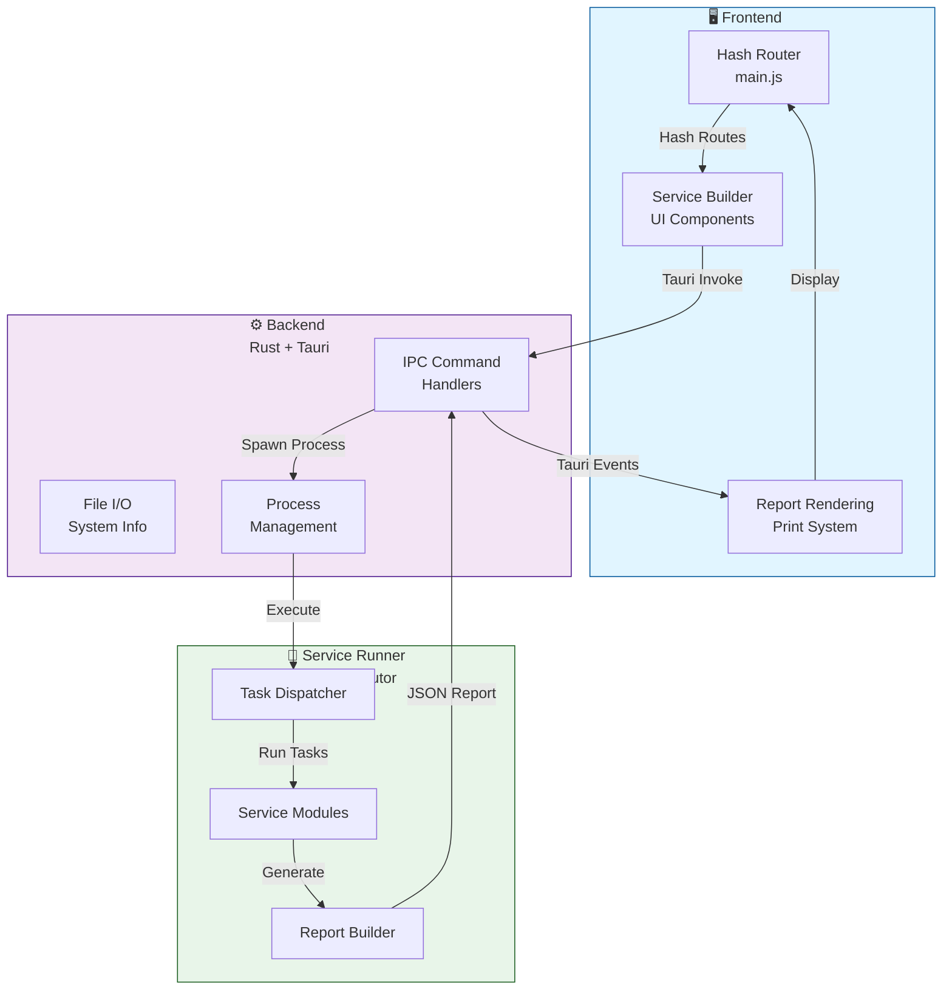

# Developer Guide Overview

Welcome to the AutoService developer documentation. This comprehensive guide covers architecture, development workflows, and contribution guidelines for building and extending AutoService.

## :material-book-open-page-variant: What You'll Find

<div class="grid cards" markdown>

- :material-graph:{ .lg .middle } **Architecture**

    ---

    Three-layer design with frontend, backend, and service runner.

    [:octicons-arrow-right-24: Learn more](architecture.md)

- :material-hammer-wrench:{ .lg .middle } **Development Setup**

    ---

    Configure your environment for AutoService development.

    [:octicons-arrow-right-24: Get started](dev-setup.md)

- :material-plus-box:{ .lg .middle } **Adding Services**

    ---

    Create new diagnostic or maintenance services.

    [:octicons-arrow-right-24: Tutorial](adding-service.md)

- :material-code-tags:{ .lg .middle } **Frontend Dev**

    ---

    Vanilla JS patterns with Vite and lit-html.

    [:octicons-arrow-right-24: Frontend guide](frontend-dev.md)

- :material-language-rust:{ .lg .middle } **Backend Dev**

    ---

    Tauri commands and Rust patterns.

    [:octicons-arrow-right-24: Backend guide](backend-dev.md)

- :material-language-python:{ .lg .middle } **Python Runner**

    ---

    Service execution engine architecture.

    [:octicons-arrow-right-24: Runner guide](python-runner.md)

- :material-folder-cog:{ .lg .middle } **Portable Layout**

    ---

    Data folder structure and organization.

    [:octicons-arrow-right-24: Layout guide](portable-layout.md)

- :material-heart-multiple:{ .lg .middle } **Contributing**

    ---

    Guidelines for contributing to the project.

    [:octicons-arrow-right-24: Contribute](contributing.md)

</div>

## :material-cog: Key Technologies

=== ":material-web: Frontend"

    | Technology | Purpose |
    |------------|---------|
    | **HTML/CSS/JavaScript** | Vanilla JS, no framework overhead |
    | **Vite** | Build tool with hot module replacement |
    | **lit-html** | Lightweight HTML templating |
    | **Fuse.js** | Fuzzy search functionality |
    | **ApexCharts** | Data visualization and charts |
    | **SortableJS** | Drag-and-drop task ordering |

=== ":material-language-rust: Backend"

    | Technology | Purpose |
    |------------|---------|
    | **Rust** | Core application logic and safety |
    | **Tauri 2** | Cross-platform desktop framework |
    | **Tokio** | Async runtime for non-blocking I/O |
    | **sysinfo** | System information collection |
    | **wgpu** | GPU detection and enumeration |
    | **battery** | Battery health monitoring |

=== ":material-language-python: Service Runner"

    | Technology | Purpose |
    |------------|---------|
    | **Python 3.9+** | Task execution and automation |
    | **PyInstaller** | Package as standalone executable |
    | **subprocess** | External tool orchestration |
    | **Sentry SDK** | Error tracking and monitoring |

## Project Structure

```text
src/                       # Frontend code
├── main.js                # Hash-based router
├── pages/                 # Page modules
│   ├── service/           # Service automation
│   ├── programs/          # Program management
│   ├── scripts/           # Script catalog
│   ├── system-info/       # Hardware info
│   └── ...
└── styles/                # CSS files

src-tauri/                 # Rust backend
├── src/
│   ├── lib.rs             # Main library, command registration
│   ├── state.rs           # App state
│   ├── commands/          # IPC handlers
│   └── ...
└── Cargo.toml             # Rust dependencies

runner/                    # Python service execution
├── service_runner.py      # Main entry point
├── services/              # Service implementations
│   ├── bleachbit_service.py
│   ├── sfc_service.py
│   └── ...
└── requirements.txt       # Python dependencies

data/                      # Portable data folder
├── programs/              # External tools
├── settings/              # JSON configuration
├── reports/               # Generated reports
└── logs/                  # Execution logs
```

## Architecture at a Glance

### Three-Layer Design



### Data Flow: Running a Service

1. **User builds task queue** in frontend (Service → Builder)
2. **Frontend generates JSON** describing the run
3. **Frontend invokes Rust** command `start_service_run`
4. **Rust spawns Python** subprocess with JSON
5. **Python executes tasks** and streams progress to stderr
6. **Frontend listens** for progress events
7. **Python returns final** report to stdout
8. **Frontend displays** results in Results view

## Development Workflow

### Initial Setup

```powershell
# Clone repository
git clone https://github.com/SonnyTaylor/AutoService.git
cd AutoService

# Install dependencies
pnpm install
pip install -r runner/requirements.txt

# Run in development
pnpm tauri dev  # Requires admin terminal
```

### Making Changes

1. **Frontend changes** - Auto-reload in dev mode
2. **Rust changes** - Tauri rebuilds on save
3. **Python changes** - Restart app to load new code

### Building for Production

```powershell
pnpm tauri build
```

Output: `src-tauri/target/release/autoservice.exe`

## Key Concepts

### Service Handler System

All service logic is self-contained in `src/pages/service/handlers/[service_id]/`:

- `index.js` - Service definition and renderers
- `fixtures/` - Test data

Each handler exports:

- `definition` - Service metadata and task builder
- `renderTech()` - Technical view renderer
- `extractCustomerMetrics()` - Customer summary (optional)
- `printCSS` - Print styles (optional)

### Portable Data Directory

All tools and settings live in `data/`:

- **Relative paths** for USB portability
- **Auto-normalization** by Rust backend
- **Accessed by frontend** via IPC commands

### Real-Time Logging

Python services emit structured markers to stderr:

```python
sys.stderr.write("TASK_START: service_name\n")
sys.stderr.flush()  # Critical for real-time updates
```

Frontend parses these markers in `src/pages/service/runner.js`.

## Common Tasks

### Add a New Service

1. Create Python handler in `runner/services/new_service.py`
2. Register in `runner/service_runner.py`
3. Create frontend handler in `src/pages/service/handlers/new_service/`
4. Register handler in `src/pages/service/handlers/index.js`

See [Adding a Service](adding-service.md) for details.

### Add a Tauri Command

1. Create handler function in `src-tauri/src/`
2. Annotate with `#[tauri::command]`
3. Register in `src-tauri/src/lib.rs` handler list

See [Backend Development](backend-dev.md) for details.

### Add a New Page

1. Create HTML in `src/pages/[page]/[page].html`
2. Create controller in `src/pages/[page]/index.js`
3. Export `initPage()` function
4. Router auto-loads based on hash

See [Frontend Development](frontend-dev.md) for details.

## Before Contributing

1. Read the project [README](../../README.md)
2. Check [contributing guidelines](contributing.md)
3. Review [architecture documentation](architecture.md)
4. Look at existing code patterns
5. Test your changes thoroughly

## Getting Help

- **Questions?** Check existing issues or create a new one
- **Want to contribute?** See [Contributing](contributing.md)
- **Found a bug?** Report it on [GitHub Issues](https://github.com/SonnyTaylor/AutoService/issues)

## Next Steps

- [Development Setup](dev-setup.md) - Set up your environment
- [Architecture Deep Dive](architecture.md) - Understand the design
- [Adding a Service](adding-service.md) - Create new functionality
- [Frontend Development](frontend-dev.md) - Work on UI
- [Backend Development](backend-dev.md) - Work on Rust backend
- [Python Runner](python-runner.md) - Extend service capabilities

---

**Version**: 0.4.0 | **Last Updated**: October 2025
