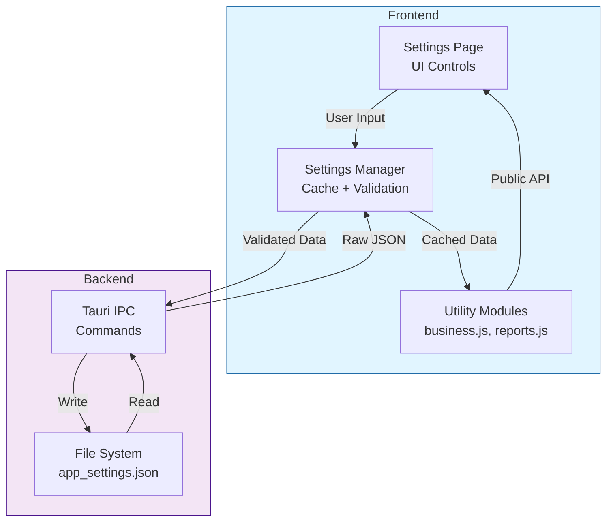

# Settings Management

AutoService uses a centralized settings management system with type-safe schema validation, automatic caching, and event-driven updates.

## Architecture Overview

The settings system consists of three main components:

1. **Settings Manager** (`src/utils/settings-manager.js`) - Centralized management with caching and validation
2. **Backend Storage** (`src-tauri/src/settings.rs`) - Persistent JSON storage
3. **Page Controllers** (`src/pages/settings/*.js`) - UI bindings



## Settings Manager API

### Basic Usage

```javascript
import { settingsManager } from '@/utils/settings-manager.js';

// Read a setting
const business = await settingsManager.get('business');
console.log(business.name); // "Acme Repairs"

// Read nested setting
const autoSave = await settingsManager.get('reports.auto_save');
console.log(autoSave); // true

// Write a setting (with debouncing)
await settingsManager.set('business.name', 'New Name');

// Write immediately (skip debouncing)
await settingsManager.set('business.name', 'New Name', true);

// Batch updates (single save operation)
await settingsManager.batch((draft) => {
  draft.business.name = 'New Name';
  draft.business.phone = '555-1234';
  draft.business.email = 'contact@newname.com';
});
```

### Event Subscriptions

Listen for changes to settings:

```javascript
// Subscribe to changes
const unsubscribe = settingsManager.on('business.name', (newValue) => {
  console.log('Business name changed:', newValue);
});

// Subscribe to parent path (fires when any child changes)
settingsManager.on('business', (businessSettings) => {
  console.log('Business settings changed:', businessSettings);
});

// Unsubscribe when done
unsubscribe();

// Remove all listeners for a path
settingsManager.off('business.name');
```

### Cache Management

```javascript
// Clear cache to force reload
settingsManager.clearCache();

// Load with force refresh
const settings = await settingsManager.load(true);
```

## Settings Schema

Settings are validated using Zod schemas. The complete schema is defined in `src/utils/settings-manager.js`:

### Business Settings

```typescript
{
  technician_mode: boolean,     // Default: false
  name: string,                 // Default: ""
  logo: string,                 // Default: "" (base64 data URL)
  address: string,              // Default: ""
  phone: string,                // Default: ""
  email: string,                // Default: "" (validated as email)
  website: string,              // Default: "" (validated as URL)
  tfn: string,                  // Default: ""
  abn: string,                  // Default: ""
  technician_names: string[]    // Default: []
}
```

### Reports Settings

```typescript
{
  auto_save: boolean,               // Default: false
  notifications_enabled: boolean,   // Default: false
  sound_enabled: boolean,           // Default: false
  sound_volume: number,             // Default: 80 (0-100)
  sound_id: string,                 // Default: "classic-beep"
  sound_repeat: number              // Default: 1 (1-10)
}
```

### Network Sharing Settings

```typescript
{
  enabled: boolean,                 // Default: false
  unc_path: string,                 // Default: ""
  save_mode: "local" | "network" | "both"  // Default: "both"
}
```

### Network Settings

```typescript
{
  iperf_server: string,     // Default: "" (validated as IP)
  ping_host: string         // Default: "8.8.8.8" (validated as IP)
}
```

### AI Settings

```typescript
{
  openai_api_key: string    // Default: ""
}
```

### Sentry Settings

```typescript
{
  environment: "development" | "production",  // Default: "production"
  send_default_pii: boolean,                  // Default: true
  traces_sample_rate: number,                 // Default: 1.0 (0-1)
  send_system_info: boolean                   // Default: true
}

// Root level:
sentry_enabled: boolean     // Default: true
```

## Creating a Settings Page

### 1. Define UI Elements

```html
<!-- src/pages/settings/settings.html -->
<div id="my-settings-pane">
  <label>
    <input type="checkbox" id="my-toggle" />
    Enable Feature
  </label>
  
  <input type="text" id="my-input" />
  
  <button id="my-save-btn">Save</button>
  
  <div id="my-status" class="settings-status"></div>
</div>
```

### 2. Initialize Settings Controller

```javascript
// src/pages/settings/my-settings.js
import { settingsManager } from '../../utils/settings-manager.js';

export async function initializeMySettings(root) {
  const toggle = root.querySelector('#my-toggle');
  const input = root.querySelector('#my-input');
  const saveBtn = root.querySelector('#my-save-btn');
  const statusEl = root.querySelector('#my-status');

  // Load current settings
  const settings = await settingsManager.get('my_section');
  toggle.checked = settings.enabled;
  input.value = settings.value;

  // Handle toggle (immediate save)
  toggle.addEventListener('change', async () => {
    try {
      await settingsManager.set('my_section.enabled', toggle.checked, true);
      showStatus('Setting saved', 'success');
    } catch (err) {
      console.error('Failed to save:', err);
      showStatus('Failed to save', 'error');
      toggle.checked = !toggle.checked; // Revert
    }
  });

  // Handle save button (batch update)
  saveBtn.addEventListener('click', async () => {
    try {
      await settingsManager.batch((draft) => {
        draft.my_section.enabled = toggle.checked;
        draft.my_section.value = input.value;
      });
      showStatus('Settings saved', 'success');
    } catch (err) {
      console.error('Failed to save:', err);
      showStatus('Failed to save', 'error');
    }
  });

  // Status message helper
  function showStatus(message, type = 'success') {
    const icon = type === 'success' ? '✓' : '✕';
    statusEl.className = `settings-status ${type}`;
    statusEl.textContent = `${icon} ${message}`;
    setTimeout(() => {
      statusEl.textContent = '';
      statusEl.className = '';
    }, 3000);
  }
}
```

### 3. Register in Settings Page

```javascript
// src/pages/settings/index.js
import { initializeMySettings } from './my-settings.js';

export async function initPage() {
  const root = document.getElementById('settings-root');
  await initializeMySettings(root);
}
```

## Creating Utility Modules

For commonly accessed settings, create utility modules with caching:

```javascript
// src/utils/my-settings.js
import { settingsManager } from './settings-manager.js';

/**
 * Get my feature settings
 * @param {boolean} [force=false] - Force cache refresh
 * @returns {Promise<Object>}
 */
export async function getMySettings(force = false) {
  if (force) {
    settingsManager.clearCache();
  }
  
  const settings = await settingsManager.get('my_section');
  
  // Normalize for backward compatibility if needed
  return {
    enabled: settings.enabled ?? false,
    value: settings.value ?? '',
  };
}

/**
 * Check if my feature is enabled
 * @returns {Promise<boolean>}
 */
export async function isMyFeatureEnabled() {
  const settings = await getMySettings();
  return settings.enabled;
}

/**
 * Clear cache (call after external updates)
 */
export function clearMySettingsCache() {
  settingsManager.clearCache();
}
```

## Adding a New Setting

### 1. Update Schema

```javascript
// src/utils/settings-manager.js

// Add new section schema
const MyNewSectionSchema = z.object({
  my_field: z.string().default(""),
  another_field: z.number().min(0).max(100).default(50),
});

// Add to root schema
const AppSettingsSchema = z.object({
  business: BusinessSchema.default({}),
  reports: ReportsSchema.default({}),
  my_new_section: MyNewSectionSchema.default({}), // Add here
  // ... other sections
});

// Export schema
export const schemas = {
  // ... existing schemas
  MyNewSection: MyNewSectionSchema,
};
```

### 2. Create Settings Page

Follow the "Creating a Settings Page" pattern above.

### 3. Create Utility Module (Optional)

If other parts of the app need to read these settings, create a utility module following the pattern above.

### 4. Update Documentation

Document the new settings in this file and in user-facing documentation.

## Best Practices

### ✅ Do

- **Use batch updates** for multiple related changes
- **Validate user input** before calling `settingsManager.set()`
- **Handle errors gracefully** and provide user feedback
- **Use immediate mode** (`set(..., true)`) for toggle switches
- **Subscribe to events** when multiple UI elements depend on same setting
- **Clear cache** when settings are modified externally

### ❌ Don't

- **Don't load settings repeatedly** - use the manager's cache
- **Don't mutate settings objects directly** - always use `set()` or `batch()`
- **Don't forget to handle errors** - settings operations can fail
- **Don't hardcode default values** - use schema defaults
- **Don't bypass the manager** - always go through `settingsManager`

## Debouncing Behavior

The settings manager automatically debounces writes to prevent excessive I/O:

```javascript
// These rapid changes only trigger ONE save operation
await settingsManager.set('reports.sound_volume', 50);
await settingsManager.set('reports.sound_volume', 60);
await settingsManager.set('reports.sound_volume', 70);
await settingsManager.set('reports.sound_volume', 80);
// ^ Single save after 500ms

// Use immediate mode to skip debouncing
await settingsManager.set('business.name', 'New Name', true);
// ^ Saves immediately
```

## Error Handling

Settings operations can fail (file I/O errors, validation errors, etc.):

```javascript
try {
  await settingsManager.set('business.email', 'invalid-email');
} catch (error) {
  // Error: Zod validation failed (not a valid email)
  console.error('Validation error:', error);
}

try {
  await settingsManager.batch((draft) => {
    draft.business.name = 'New Name';
  });
} catch (error) {
  // Error: File system error, settings rolled back
  console.error('Save failed, changes reverted:', error);
}
```

The manager automatically rolls back failed saves to prevent data corruption.

## Migration from Old Pattern

### Before (Manual Load/Save)

```javascript
// ❌ Old pattern - duplicated everywhere
async function saveBusinessName(name) {
  try {
    const settings = await invoke('load_app_settings');
    settings.business = settings.business || {};
    settings.business.name = name;
    await invoke('save_app_settings', { data: settings });
    clearBusinessCache();
    showStatus('Saved', 'success');
  } catch (err) {
    showStatus('Failed', 'error');
  }
}
```

### After (Settings Manager)

```javascript
// ✅ New pattern - centralized and consistent
async function saveBusinessName(name) {
  try {
    await settingsManager.set('business.name', name, true);
    showStatus('Saved', 'success');
  } catch (err) {
    showStatus('Failed', 'error');
  }
}
```

**Benefits:**

- 60% less code
- Automatic validation
- Built-in caching
- Automatic rollback on error
- Type-safe with IDE hints

## Testing Settings

### Unit Testing Settings Logic

```javascript
// tests/settings.test.js
import { settingsManager } from '../src/utils/settings-manager.js';

// Test validation
try {
  await settingsManager.set('business.email', 'not-an-email');
  console.error('Validation should have failed!');
} catch (err) {
  console.log('✓ Validation works');
}

// Test caching
const first = await settingsManager.get('business');
const second = await settingsManager.get('business');
console.log('✓ Cache works:', first === second);

// Test events
let eventFired = false;
settingsManager.on('business.name', () => {
  eventFired = true;
});
await settingsManager.set('business.name', 'Test');
console.log('✓ Events work:', eventFired);
```

### Integration Testing

Test settings UI by:

1. Opening Settings page
2. Changing values
3. Clicking Save
4. Checking `data/settings/app_settings.json`
5. Reloading app and verifying values persist

## Troubleshooting

### Settings not persisting

1. Check browser console for errors
2. Verify `data/settings/` directory exists and is writable
3. Check Tauri backend logs for file I/O errors

### Cache not updating

1. Call `settingsManager.clearCache()` after external changes
2. Verify event subscriptions are set up correctly
3. Check for multiple manager instances (should be singleton)

### Validation errors

1. Check schema definitions in `settings-manager.js`
2. Verify input format matches schema requirements
3. Use browser console to see Zod validation messages

---

**See Also:**

- [Frontend Development](frontend-dev.md) - General frontend patterns
- [Backend Development](backend-dev.md) - Rust command handlers
- [Architecture](architecture.md) - Overall system design
